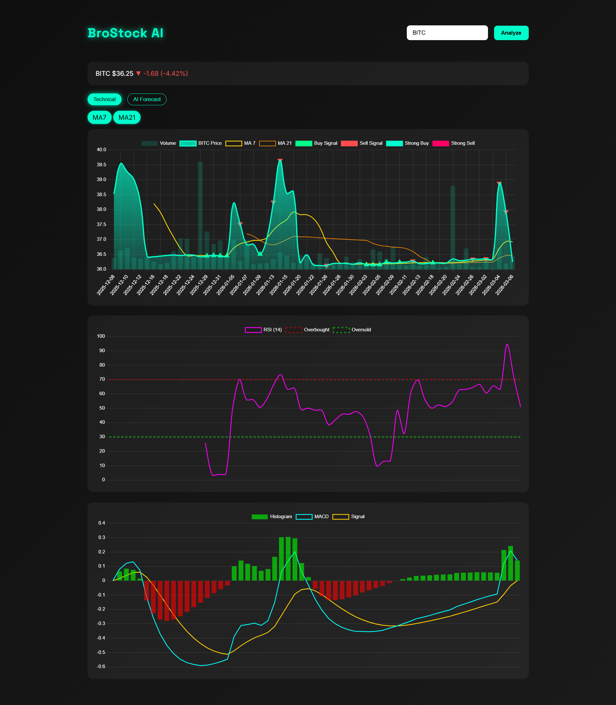

# BroStock AI
AI-powered stock analytics dashboard built with **FastAPI, JavaScript, and Chart.js**.
It provides **technical analysis indicators, multi-panel financial charts, and short-term AI price forecasting** in a modern trading-terminal style interface.

### Technical Analysis Dashboard

### AI Forecast Mode

# Features

## Price & Trend Analysis
- Live stock price fetching via **Yahoo Finance (yfinance)**
- Interactive dynamic price chart built with **Chart.js**
- **7-day and 21-day Moving Averages (MA7, MA21)**
- Toggle controls for indicator visibility
- Adaptive chart rendering for cleaner trend visualization

---

## Volume Analysis
- Integrated **volume bars within the price chart**
- Dual-axis scaling for accurate price/volume comparison
- Helps confirm price movement strength

---

## RSI (Relative Strength Index – 14)
- Dedicated **momentum analysis panel**
- Overbought (70) and Oversold (30) reference levels
- Backend-calculated rolling averages
- Defensive handling of NaN / infinite values

---

## MACD (Moving Average Convergence Divergence)
- EMA(12) and EMA(26) MACD calculation
- 9-period Signal line
- Histogram visualization
- Dynamic green/red momentum bars
- Separate synchronized chart panel

---

# AI Forecasting

BroStock AI now includes an **AI-powered forecasting module** that predicts short-term price movement using **linear regression trend modeling**.

### AI Forecast Panel
- Separate **AI Forecast chart mode**
- Historical price vs predicted future prices
- Forecast displayed as **dashed projection line**

### Forecast Horizon Controls
Users can dynamically select forecast length:

- **7 Days**
- **14 Days**
- **30 Days**

The chart automatically updates without reloading the page.

### Forecast Model
The backend trains a **Linear Regression model** on historical price data to estimate short-term price trajectory.
While intentionally simple, it demonstrates the integration of **machine learning workflows inside a real-time analytics dashboard**.

---

# Dashboard Controls

- **Technical Mode / AI Forecast Mode toggle**
- Forecast horizon selection (7D / 14D / 30D)
- Indicator visibility toggles
- Responsive trading-terminal style interface
- Smooth chart transitions and redraws

---

# Data Integrity & Stability

Financial data can contain missing or unstable values.  
The backend includes defensive engineering to ensure stable visualization.

- Safe float sanitization before JSON serialization
- NaN / infinite value handling
- Pandas multi-index normalization
- Stable backend-frontend data contracts

---

# Tech Stack

## Backend
- Python
- FastAPI
- yfinance
- pandas
- NumPy
- scikit-learn (Linear Regression)

## Frontend
- HTML
- CSS (custom dark UI)
- JavaScript (ES Modules)
- Chart.js

---

# Architecture Overview

User Input  
→ JavaScript fetch request  
→ FastAPI backend  
→ Yahoo Finance data (yfinance)  
→ Backend computes indicators (MA, RSI, MACD)  
→ Linear Regression model generates forecast  
→ Safe JSON serialization  
→ Chart.js renders interactive dashboard

All financial calculations and forecasting are performed in the **backend** to ensure numerical stability and clean architecture.

---

# Indicators Explained

### Moving Averages (MA7 / MA21)
Used to smooth price data and identify short-term vs medium-term trends.

### Volume
Confirms strength behind price movement.
High volume during breakouts often signals stronger conviction.

### RSI (14)
Momentum oscillator:

- Above **70 → Overbought**
- Below **30 → Oversold**

### MACD
Trend-following momentum indicator:

- MACD crossing above signal → Bullish shift
- MACD crossing below signal → Bearish shift
- Histogram visualizes momentum acceleration

---

# Project Structure

backend/
* main.py
* stock_analyzer.py

frontend/
* index.html
* style.css
js/
* app.js
* charts.js
* ui.js
* api.js

The application follows a **clear separation of concerns**:
- Backend handles **data, indicators, and forecasting**
- Frontend handles **rendering and user interaction**

---

# Roadmap

Future improvements planned for BroStock AI:
- AI **confidence interval bands**
- Portfolio backtesting tool
- Candlestick chart mode
- Time-range selector (1W, 1M, 3M, 1Y)
- Crosshair synchronization across charts
- AI buy/sell signal engine
- News sentiment integration
- Public cloud deployment

---

# Why This Project?
This project demonstrates practical skills in:

- Full-stack system design
- Financial indicator implementation
- Machine learning integration
- API design & structured JSON contracts
- Defensive data engineering
- Chart.js multi-panel visualization
- Interactive UI state management
It serves as both a **learning project and a portfolio piece showcasing applied financial analytics and web engineering.**

---

# Disclaimer
This project is for **educational and portfolio purposes only**.
It does **not provide financial advice or trading recommendations.**
