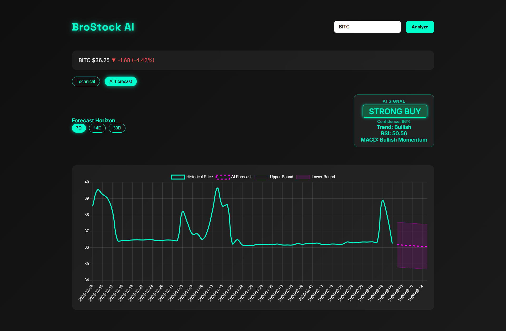

# BroStock AI

AI-powered stock analytics dashboard built with **FastAPI, JavaScript, and Chart.js**.  
It provides **technical analysis indicators, multi-panel financial charts, and short-term AI price forecasting** in a modern trading-terminal style web interface.

---

## Live Demo (Coming Soon)

A **live hosted version** of BroStock AI will be deployed soon using a **hybrid cloud architecture**.

Planned stack:

- **Render** → FastAPI backend hosting  
- **Supabase** → database and backend services  
- **Framer** → public-facing web interface  
- **Make.com** → workflow automation

The current GitHub repository contains the **core application source code only**, intended for **project demonstration and portfolio purposes**.

### Technical Analysis Dashboard

### AI Forecast Mode

---

## Example Trading Interface
The dashboard provides two main analysis modes:

### Technical Analysis Mode
Displays price action with indicators and trade signal markers.

### AI Forecast Mode
Displays short-term price projection along with an aggregated AI trading signal.

---

# Overview

BroStock AI is a **full-stack financial analytics dashboard** that combines:

- real-time market data
- technical indicators
- machine learning forecasting

into a single interactive web application.
The system fetches stock market data using **Yahoo Finance**, processes the data in a **FastAPI backend**, and visualizes the indicators through synchronized multi-panel charts built with **Chart.js**.
This project demonstrates how **financial analytics pipelines and machine learning models can be integrated into a modern web application architecture.**

---

# Features

---

## Price & Trend Analysis

- Live stock price fetching via **Yahoo Finance (yfinance)**
- Interactive price charts built with **Chart.js**
- **7-day and 21-day Moving Averages (MA7, MA21)**
- Integrated **volume bars inside the main price chart**
- Toggle controls for indicators

---

## Trade Signal Markers

The technical chart includes visual **trade signal markers** generated from indicator conditions.
Markers displayed on the chart:

- ▲ **Buy Signal**
- ▼ **Sell Signal**
- ★ **Strong Buy**
- ✖ **Strong Sell**

Signals are derived from combinations of:

- Moving Average crossovers
- RSI momentum conditions
- MACD trend confirmation

These markers help highlight potential entry and exit points directly on the price chart.

---

## Volume Analysis

- Integrated **volume bars within the price chart**
- Dual-axis scaling for accurate price/volume comparison
- Helps confirm price movement strength

---

## RSI (Relative Strength Index – 14)

Momentum indicator displayed in a **dedicated analysis panel**.
Features include:
- RSI(14) calculation
- Overbought level at **70**
- Oversold level at **30**
- Rolling averages computed in the backend
- Defensive handling of NaN / infinite values

---

## MACD (Moving Average Convergence Divergence)

Trend-following momentum indicator with its own chart panel.
Includes:
- EMA(12) and EMA(26) MACD calculation
- 9-period Signal line
- Histogram visualization
- Dynamic momentum bars (green/red)
- Synchronized time axis with the price chart

---

# AI Forecasting

BroStock AI includes an **AI-powered forecasting module** that predicts short-term price movement using **linear regression trend modeling**.

---

## AI Forecast Panel

- Separate **AI Forecast chart mode**
- Historical price vs predicted future prices
- Forecast displayed as a **dashed projection line**

---

## Forecast Horizon Controls

Users can dynamically select forecast length:
- **7 Days**
- **14 Days**
- **30 Days**

The chart updates automatically without reloading the page.

---

# AI Signal Engine

In addition to price forecasting, BroStock AI generates a **trade signal summary** using multiple technical indicators.
The AI Signal panel evaluates:
- Trend direction
- RSI momentum
- MACD momentum
- Forecasted price movement

The system then produces an aggregated signal:
- **Strong Buy**
- **Buy**
- **Neutral**
- **Sell**
- **Strong Sell**

Example signal output:
- AI SIGNAL  
- STRONG BUY  
- Confidence: 66%  
- Trend: Bullish  
- RSI: 50.56  
- MACD: Bullish Momentum

This provides a quick high-level interpretation of the current market conditions.

---

### Forecast Model
The backend trains a **Linear Regression model** on historical price data to estimate short-term price trajectory.
While intentionally simple, it demonstrates the integration of **machine learning workflows inside a real-time analytics dashboard**.

---

# Dashboard Controls

The interface provides several interactive controls:
- **Technical Mode / AI Forecast Mode toggle**
- Forecast horizon selection (7D / 14D / 30D)
- Indicator visibility toggles (MA7 / MA21)
- AI signal summary panel
- Smooth chart redraws when switching modes
- Trading-terminal inspired dark interface

---

# Data Integrity & Stability

Financial data can contain missing or unstable values.  
The backend includes defensive engineering to ensure stable visualization.

- Safe float sanitization before JSON serialization
- NaN / infinite value handling
- Pandas multi-index normalization
- Stable backend-frontend data contracts

---

# Tech Stack

## Backend
- Python
- FastAPI
- yfinance
- pandas
- NumPy
- scikit-learn (Linear Regression)

## Frontend
- HTML
- CSS (custom dark UI)
- JavaScript (ES Modules)
- Chart.js

---

# Architecture Overview

User Input  
→ JavaScript fetch request  
→ FastAPI backend  
→ Yahoo Finance data (yfinance)  
→ Backend computes indicators (MA, RSI, MACD)  
→ Linear Regression model generates forecast  
→ Safe JSON serialization  
→ Chart.js renders interactive dashboard

All financial calculations and forecasting are performed in the **backend** to ensure numerical stability and clean architecture.

---

# Indicators Explained

### Moving Averages (MA7 / MA21)
Moving averages smooth price data and help identify short-term versus medium-term trends.

---

### Volume
Volume confirms the strength behind price movement.  
High volume during breakouts often signals stronger market conviction.

---

### RSI (14)
Momentum oscillator:
- Above **70 → Overbought**
- Below **30 → Oversold**

---

### MACD
Trend-following momentum indicator:
- MACD crossing above signal → Bullish shift
- MACD crossing below signal → Bearish shift
- Histogram visualizes momentum acceleration

---

# Project Structure

backend/
├── main.py
└── stock_analyzer.py

frontend/
├── index.html
├── style.css
└── js/
├── app.js
├── charts.js
├── ui.js
└── api.js

The application follows a **clear separation of concerns**:

**Backend**
- Data fetching
- Indicator calculations
- AI forecasting

**Frontend**
- Data visualization
- Chart rendering
- User interface controls

---

# Running Locally

Clone the repository:
git clone https://github.com/RDC4321/BroStock-AI.git
cd BroStock-AI

Install dependencies:
pip install -r requirements.txt

Run the server:
uvicorn main:app --reload

Open in browser:
http://127.0.0.1:8000

---

# Roadmap

Future improvements planned for BroStock AI:
- AI **confidence interval bands**
- Portfolio backtesting tool
- Candlestick chart mode
- Time-range selector (1W, 1M, 3M, 1Y)
- Crosshair synchronization across charts
- News sentiment integration
- Cloud deployment

---

# Why This Project?

This project demonstrates practical skills in:
- Full-stack system design
- Financial indicator implementation
- Machine learning integration
- API design and structured JSON contracts
- Defensive data engineering
- Chart.js multi-panel visualization
- Interactive UI state management
The system demonstrates how **traditional technical analysis and machine learning models can be combined into a unified trading dashboard.**

---

# Disclaimer

This project is for **educational and portfolio purposes only**.
It does **not provide financial advice or trading recommendations.**
